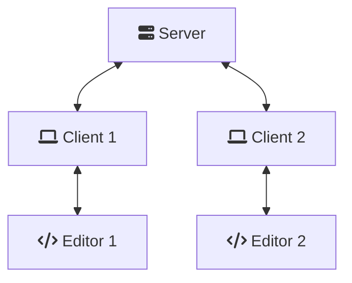

# Why is it so complicated?

Getting editors synced through an LSP connection is hard, a lot harder than I
initially thought.

## Overview

To better understand the problem, let's take a simple example:

- 2 editors are connected to the same server

Here we don't have to deal with 2 or 3 programs but **5**:

- 2 `editors`, which play the role of LSP clients, sending their modifications
  to the `codlab-client`s
- 2 `codlab-client`s, which play the role of the LSP servers, receiving
  modifications from the server and the editor and transfering them
- 1 `codlab-server` which for now only broadcasts all the messages it receives,
  but should be the place conflics should be resolved, before broadcasting

And we need to keep the documents state in sync for all of these programs.

## Editors

Even though we're using the
[Language server protocol](https://microsoft.github.io/language-server-protocol/specifications/lsp/3.17/specification/)
to speak with the editors, all the editors don't behave exactly the same across
the editors.

So even though the program might seem to working with a certain combination of
editors, it probably will fail with another.

## Misc issues

- I've observed in my tests that helix sometimes sent changes out of order (in
  "hello world", it sent the `w` before the space), which caused a desync
  between the clients.
- Editors send notification to the LSP servers on each change, including the
  ones applied by LSP servers themself. And I couldn't find a robust way of
  detecting changes which come from codlab from the changes the user typed.
